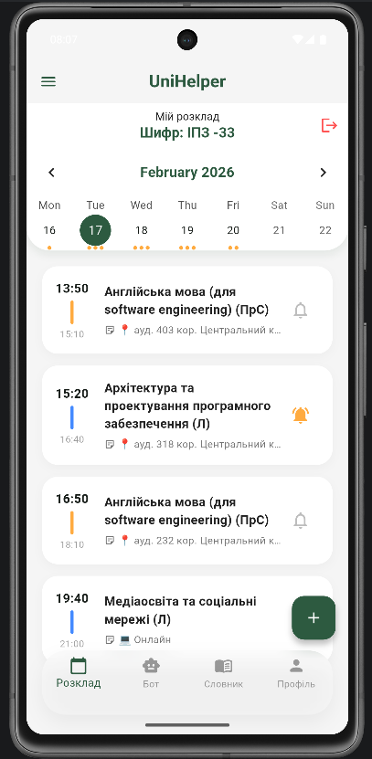
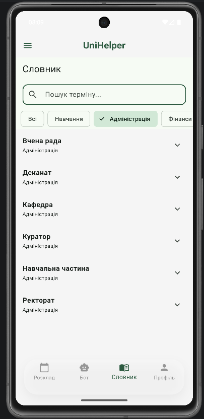
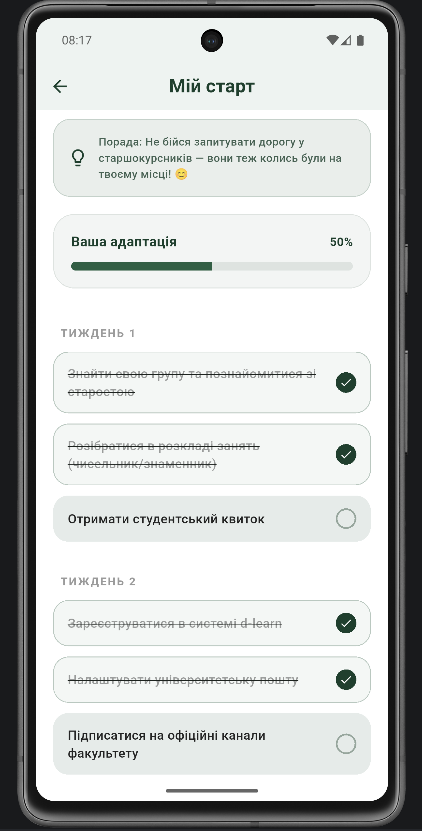
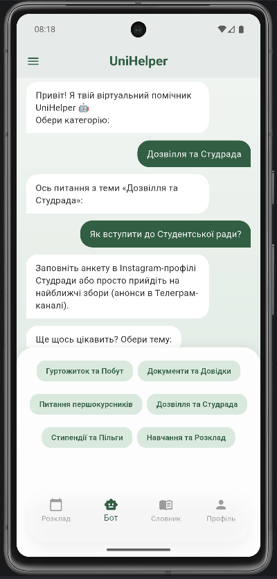
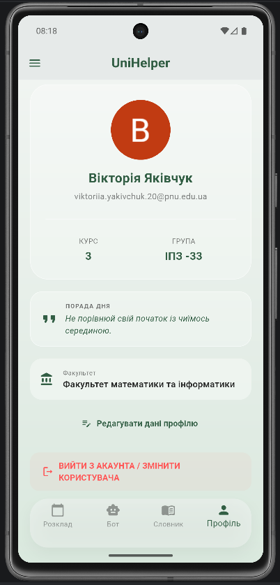
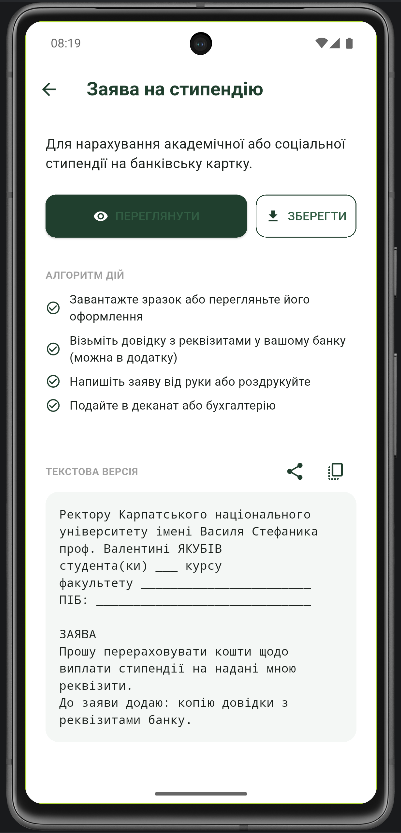
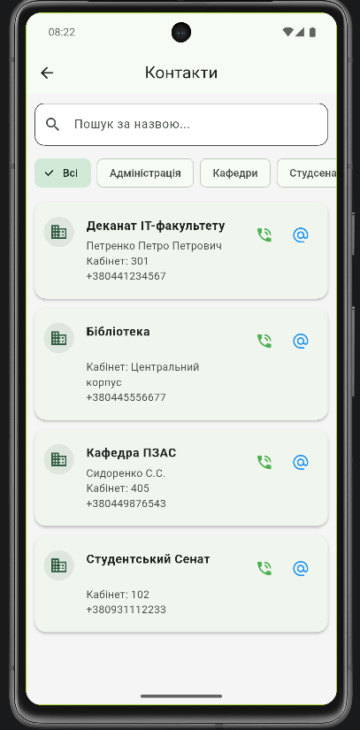
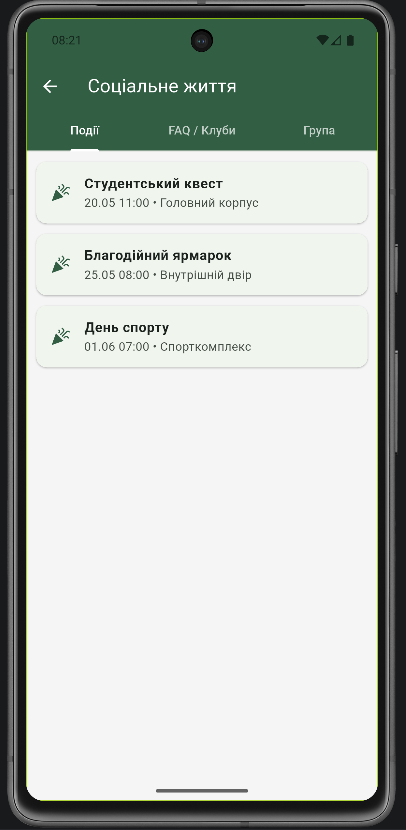
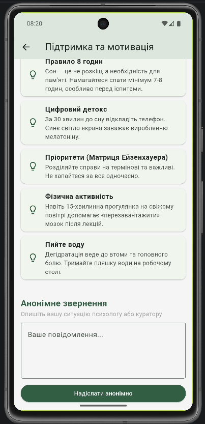

# UniHelper 🎓 — Твій навігатор у студентське життя

**UniHelper** — це мобільний додаток на Flutter, створений спеціально для першокурсників. Він допомагає адаптуватися до навчання, знайти потрібні кабінети, розібратися з документами та завжди мати під рукою актуальний розклад.

---

## 📸 Скріншоти додатку
<table>
  <tr>
    <td></td>
    <td></td>
    <td></td>
    <td></td>
    <td></td>
    <td></td>
    <td></td>
    <td></td>
    <td></td>
    <td></td>
  </tr>
  <tr>
    <td align="center">Головний екран</td>
    <td align="center">Розклад занять</td>
    <td align="center">Словник термінів</td>
    <td align="center">План адаптації</td>
    <td align="center">Чат-бот</td>
    <td align="center">Профіль користувача</td>
    <td align="center">Путівник по документах</td>
    <td align="center">Корисні контакти</td>
    <td align="center">Соціальне життя</td>
    <td align="center">Мотивація та підтримка</td>
  </tr>
</table>

---

## ✨ Основні функції

Згідно з технічним завданням, у додатку реалізовано:

- **📅 Розумний розклад:** Автоматичний парсинг даних з офіційного сайту університету. Підтримка офлайн-режиму та додавання власних подій.
- **📖 Словничок:** Пояснення складних університетських термінів (деканат, модуль, ректор тощо).
- **📄 Путівник по документах:** PDF-інструкції та зразки заяв на стипендію, гуртожиток чи студентський квиток.
- **✅ План адаптації:** Інтерактивний чек-лист завдань для новачка.
- **📞 Контакти:** База номерів телефонів та адрес підрозділів університету.
- **🌱 Підтримка:** Поради на кожен день та форма анонімного звернення.

---

## 📂 Структура проєкту

Проєкт побудований за принципами Clean Architecture (спрощено по фічах):

```text
lib/
├── core/                 # Загальні сервіси, утиліти та теми
│   ├── services/         # Сповіщення, робота з мережею
│   └── utils/            # Константи та дані університету
├── features/             # Основні модулі додатку
│   ├── adaptation/       # План адаптації та чек-листи
│   ├── auth/             # Авторизація та профілі користувачів
│   ├── chatbot/          # Логіка та UI чат-бота
│   ├── contacts/         # Довідник контактів
│   ├── documents/        # Путівник по документах (PDF)
│   ├── glossary/         # Словник термінів
│   ├── schedule/         # Модуль розкладу (Repo, Models, UI)
│   ├── social_life/      # Події та FAQ
│   └── support/          # Психологічна підтримка та поради
├── main.dart             # Точка входу в додаток
assets/
├── data/                 # JSON файли з даними
├── docs/                 # PDF документи та зразки заяв
└── images/               # Графічні ресурси
